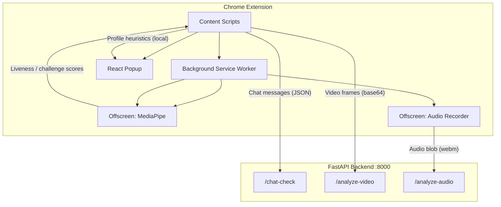
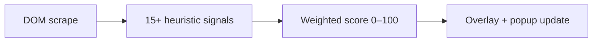
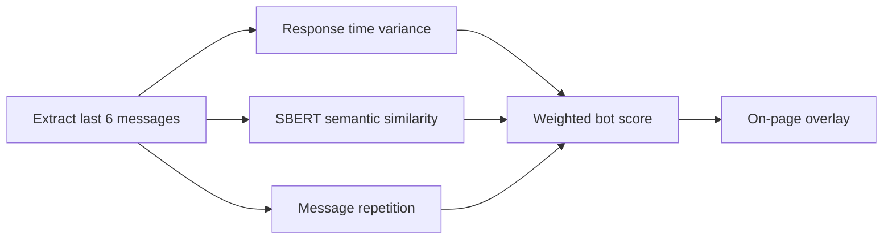
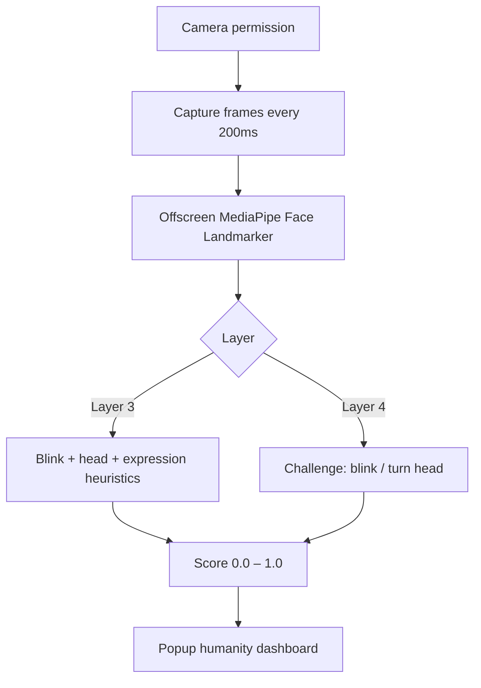

# HumanityCheck

A Chrome extension and FastAPI backend for detecting bots, AI-generated media, and verifying human presence across social platforms and live sessions.

# Overview

HumanityCheck addresses the growing challenge of distinguishing humans from automated or synthetic content online. It combines a Manifest V3 Chrome extension with a local Python backend to analyze signals in real time across multiple contexts:

- **Social profiles** — heuristic scoring of Twitter/X account authenticity
- **Chat conversations** — bot-likelihood analysis in Telegram Web
- **Video and audio** — deepfake and AI-voice detection on Twitter/X
- **Live sessions** — camera-based liveness and active challenge verification on Google Meet, LeetCode contests, and HackerRank contests

The extension injects content scripts into supported sites, captures media or DOM data, and either scores locally or sends payloads to the backend at `http://127.0.0.1:8000`. Results are shown in the extension popup and as on-page overlays.

# Features

| Area | Platform | Description |
|------|----------|-------------|
| Profile analysis | Twitter / X | Scrapes profile metadata from the DOM and scores authenticity (0–100) using 15+ heuristic signals |
| Video deepfake detection | Twitter / X | Captures 5 frames from detected videos and sends them to the backend for analysis |
| AI audio detection | Twitter / X | Records 10 seconds of tab audio via Chrome tab capture and sends it to the backend |
| Chat bot detection | Telegram Web | Extracts the last 6 messages, sends them to the backend, and displays an AI probability overlay |
| Passive liveness (Layer 3) | Google Meet, LeetCode, HackerRank | Uses the webcam and MediaPipe Face Landmarker to score blinks, head movement, and expression changes |
| Active challenge (Layer 4) | Google Meet, LeetCode, HackerRank | Prompts the user to blink or turn their head, then validates the action against face landmarks |
| Humanity score dashboard | Google Meet | Popup displays combined Layer 3 + Layer 4 scores with live refresh |
| Auto profile scan | Twitter / X | Automatically re-analyzes profiles on SPA navigation (4-second delay) |
| Auto video scan | Twitter / X | MutationObserver detects new `<video>` elements and analyzes them once |

# Tech Stack

| Layer | Technologies |
|-------|-------------|
| **Extension** | JavaScript (ES modules), React 19, Vite 8, `@crxjs/vite-plugin`, Chrome Extension Manifest V3 |
| **Computer vision (client)** | MediaPipe Tasks Vision (`FaceLandmarker`, WASM bundled locally) |
| **Backend** | Python, FastAPI, Uvicorn, Pydantic |
| **ML / NLP** | PyTorch, torchvision (ResNet18), sentence-transformers (`all-MiniLM-L6-v2`), NumPy, scikit-learn |
| **Audio processing** | librosa, PyAV (`av`) |
| **Image processing** | OpenCV (`cv2`) |
| **APIs / browser APIs** | Chrome `tabCapture`, `offscreen`, `scripting`, `storage`, `getUserMedia`, `MediaRecorder` |

# Project Structure

```
HumanityCheck/
├── Backend/
│   ├── main.py                  # FastAPI app entry point, CORS, route registration
│   ├── requirements.txt         # Python dependencies
│   ├── models/
│   │   ├── chat_model.py        # Telegram chat bot scoring (SBERT + heuristics)
│   │   └── deepfake_model.py    # Video frame analysis (ResNet18)
│   ├── routes/
│   │   ├── chat.py              # POST /chat-check
│   │   ├── video.py             # POST /analyze-video
│   │   └── audioRoute.py        # POST /analyze-audio
│   └── services/
│       └── audio_analyzer.py    # Audio feature extraction and rule-based scoring
│
└── ChromeExtension/
    ├── manifest.json            # Extension permissions and content script matches
    ├── vite.config.js           # Vite + CRX build config, MediaPipe WASM copy
    ├── index.html               # Popup entry HTML
    ├── package.json
    ├── public/
    │   └── mediapipe-wasm/      # Bundled MediaPipe WASM runtime
    └── src/
        ├── background/
        │   └── background.js    # Service worker: offscreen routing, tab audio capture
        ├── popup/
        │   ├── App.jsx          # React popup UI (platform-aware)
        │   └── main.jsx
        ├── offscreen/
        │   ├── offscreen.html   # MediaPipe face analysis offscreen document
        │   └── offscreen.js     # Liveness and challenge frame processing
        ├── audio/
        │   ├── offscreen1.html  # Tab audio recording offscreen document
        │   └── offscreen1.js    # MediaRecorder → backend upload
        └── scripts/
            ├── index.js         # Content script entry: platform routing, Meet monitoring
            ├── layer3.js        # Camera capture + passive liveness
            ├── layer4.js        # Active challenge UI + validation
            ├── twitterProfile.js # Twitter profile scraping and scoring
            ├── twitterVideo.js  # Video frame capture and deepfake UI
            ├── twitteraudio.js  # Triggers tab audio capture on playing videos
            ├── chat.js          # Telegram message extraction and bot detection
            ├── humananalysis.js # Legacy liveness module (not wired into index.js)
            ├── humananalysis2.js# Legacy challenge module (not wired into index.js)
            └── meetAudio.js     # Meet audio capture helper (not wired into index.js)
```

# Installation

## Prerequisites

- **Node.js** 18+ and npm
- **Python** 3.10+
- **Google Chrome** (Manifest V3 extension)

## Clone the repository

```bash
git clone <repository-url>
cd HumanityCheck
```

## Backend setup

```bash
cd Backend
python -m venv venv

# Windows
venv\Scripts\activate

# macOS / Linux
source venv/bin/activate

pip install -r requirements.txt
pip install opencv-python librosa av torchvision
```

> **Note:** `requirements.txt` lists core packages. The backend also imports `opencv-python`, `librosa`, `av`, and `torchvision`, which must be installed separately (or added to `requirements.txt`).

On first run, `sentence-transformers` downloads the `all-MiniLM-L6-v2` model (~90 MB). PyTorch may download ResNet18 ImageNet weights automatically.

## Extension setup

```bash
cd ChromeExtension
npm install
npm run build
```

The build output is written to `ChromeExtension/dist/`.

# Running the Project

## 1. Start the backend

```bash
cd Backend
# Activate venv if not already active
uvicorn main:app --reload --host 127.0.0.1 --port 8000
```

Verify the server is running:

```bash
curl http://127.0.0.1:8000/
# {"message":"Backend Running"}
```

## 2. Load the Chrome extension

1. Open `chrome://extensions`
2. Enable **Developer mode**
3. Click **Load unpacked**
4. Select the `ChromeExtension/dist/` folder

## 3. Grant permissions

When prompted by the extension or browser:

- Allow **camera access** for liveness checks on Meet / contest pages
- Allow **tab audio capture** when analyzing Twitter/X video audio

# Usage

## Twitter / X

| Action | How |
|--------|-----|
| Profile analysis | Navigate to a user profile. Analysis runs automatically after navigation, or click **Analyze Now** in the popup |
| Video deepfake check | Scroll to a tweet with video — analysis starts automatically when the video plays |
| Audio AI check | Play a video with audio — the extension records 10 seconds of tab audio automatically (once per video) |

Results appear as an on-page overlay (profiles) or a badge on the video player (video/audio).

## Telegram Web

1. Open a chat at `web.telegram.org`
2. Click the extension icon
3. Click **Start Chat Detection**
4. Once at least 6 messages are collected, the overlay shows the AI probability score

## Google Meet / LeetCode / HackerRank

1. Join a Google Meet call, or open a LeetCode or HackerRank **contest** page
2. The extension detects the session and prompts for camera permission (Layer 3)
3. Layer 4 presents active challenges: blink, turn head left, turn head right
4. Open the popup to view the combined **Humanity Score** (50% Layer 3 + 50% Layer 4)

Scores re-evaluate periodically (Layer 3 every 2 minutes, Layer 4 every 2.5 minutes).

# How It Works

## System architecture



## Detection pipelines

### Twitter profile (client-side)



Signals include verification status, profile completeness, account age, follower/following ratio, tweet repetition, default photo, and more.

### Telegram chat (backend)



### Video deepfake (backend)

1. Content script captures 5 JPEG frames (1 per second) from each new video
2. Frames are base64-encoded and POSTed to `/analyze-video`
3. Backend decodes frames with OpenCV, runs ResNet18 inference, returns `real_confidence`
4. Extension displays **Authentic** or **AI-Generated** badge on the video player

### Audio AI detection (backend)

1. `twitteraudio.js` detects a playing video and requests tab capture via the background worker
2. Offscreen document records 10 seconds of audio as WebM
3. Blob is POSTed to `/analyze-audio`
4. Backend extracts acoustic features with librosa and applies rule-based scoring

### Meet liveness (client-side)



# Models / Algorithms

## 1. Telegram chat bot detection

| Component | Detail |
|-----------|--------|
| **Model** | `sentence-transformers/all-MiniLM-L6-v2` (pretrained, not fine-tuned in-repo) |
| **Dataset** | None — uses pretrained embeddings at inference time |
| **Features** | Response time variance, pairwise cosine similarity of bot messages, exact-message repetition rate |
| **Scoring weights** | 40% response time, 40% similarity, 20% repetition |
| **Output** | `score` (0–1, higher = more bot-like), per-feature `details` |
| **Threshold** | Returns neutral `0.5` if fewer than 2 messages are provided |

**Response time logic:** Low variance in reply delays (< 1000 ms²) scores as bot-like (0.9); higher variance scores as human-like (0.3).

## 2. Video deepfake detection

| Component | Detail |
|-----------|--------|
| **Architecture** | ResNet18 with a replaced final layer: `Linear(512, 1) → Sigmoid` |
| **Weights** | ImageNet pretrained backbone; **no project-specific deepfake weights are loaded** |
| **Preprocessing** | BGR → RGB, resize to 224×224, `ToTensor()` |
| **Inference** | Per-frame sigmoid output averaged across all valid frames |
| **Output** | `real_confidence` (0–1, clamped); fallback `0.5` on empty input |
| **Evaluation metrics** | Not implemented in-repo |
| **Limitations** | Without fine-tuned weights, predictions are not reliable for deepfake detection. Commented-out code references MesoNet (`Meso4_DF.h5`) as a planned alternative |

## 3. Audio AI / synthetic voice detection

| Component | Detail |
|-----------|--------|
| **Approach** | Rule-based heuristic scoring on hand-crafted features (no trained ML model) |
| **Preprocessing** | PyAV decode → mono mixdown → peak normalization → resample to 16 kHz → silence trim |
| **Features** | Pitch variance (librosa pyin), RMS energy variance, pause duration/variance, zero-crossing rate variance, spectral flatness variance, MFCC variance |
| **Scoring** | Starts at 50; adds/subtracts points based on feature thresholds; clamped to 0–100 |
| **Label** | `Likely AI` if score > 60, else `Likely Human` |
| **Output** | `aiProbability`, `label`, `features`, `flags` |
| **Limitations** | Heuristic only; not trained or validated on a labeled dataset |

## 4. Twitter profile bot scoring (client-side)

| Component | Detail |
|-----------|--------|
| **Approach** | 15 weighted heuristic signals scraped from the Twitter DOM |
| **Base score** | Starts at 35, adjusted by signals, clamped 0–100 |
| **Labels** | ≥ 70 Likely Human, ≥ 40 Suspicious, < 40 Likely Bot |
| **No ML model** | Pure rule-based analysis; runs entirely in the browser |

## 5. Liveness and active challenge (client-side)

| Component | Detail |
|-----------|--------|
| **Model** | MediaPipe Face Landmarker (`face_landmarker.task`, loaded from Google Cloud Storage) |
| **Layer 3 signals** | Eye Aspect Ratio (EAR) blinks, nose-x head direction changes, mouth-width expression changes |
| **Layer 3 scoring** | 40% blink (≥ 2 blinks), 30% head diversity (≥ 2 directions), 30% expression changes (≥ 2) |
| **Layer 4 challenges** | Blink eyes, turn head left, turn head right — each scored 50% blink match + 50% head direction match |
| **Observation window** | 10 seconds per evaluation cycle |
| **Limitations** | Heuristic thresholds; head left/right mapping is inverted relative to nose position |

# Configuration

| Setting | Location | Default | Notes |
|---------|----------|---------|-------|
| Backend URL | `chat.js`, `twitterVideo.js`, `offscreen1.js` | `http://127.0.0.1:8000` | Hardcoded; change in source to point elsewhere |
| CORS | `Backend/main.py` | `allow_origins=["*"]` | Open for local development |
| Chat message threshold | `chat.js` | 6 messages | Minimum before backend call |
| Audio recording duration | `twitteraudio.js` | 10 000 ms | One recording per video |
| Video frame count | `twitterVideo.js` | 5 frames | 1-second intervals |
| Liveness re-run interval | `index.js` | 120 s (Layer 3), 150 s (Layer 4) | |
| SBERT model | `chat_model.py` | `all-MiniLM-L6-v2` | Auto-downloaded on first import |
| Deepfake model weights | `models/weights/` | Gitignored (`.h5`, `.pth`) | MesoNet weights referenced in comments but not active |
| Environment variables | — | None | No `.env` file is used |

### Extension permissions

Defined in `manifest.json`:

- `tabs`, `scripting`, `storage`, `tabCapture`, `offscreen`
- Host permissions: `<all_urls>`
- Content scripts match: Telegram, Twitter/X, Google Meet, LeetCode, HackerRank

# API Reference

| Method | Endpoint | Input | Output |
|--------|----------|-------|--------|
| `GET` | `/` | — | `{"message": "Backend Running"}` |
| `POST` | `/chat-check` | `{ "chat": [{ "text", "sender", "time" }] }` | `{ "score", "details": { "response_time", "similarity", "repetition" } }` |
| `POST` | `/analyze-video` | `{ "frames": ["data:image/jpeg;base64,..."] }` | `{ "real_confidence": float }` |
| `POST` | `/analyze-audio` | `multipart/form-data` file upload | `{ "aiProbability", "label", "features", "flags" }` |


# Contributing

1. Fork the repository and create a feature branch from `main`
2. Set up both the Backend virtual environment and the ChromeExtension npm dependencies
3. Run the backend with `uvicorn main:app --reload` and build the extension with `npm run build`
4. Load the unpacked extension from `ChromeExtension/dist/` and test on supported platforms
5. Follow existing code conventions: ES modules in the extension, FastAPI routers in the backend
6. Keep changes focused — avoid modifying unrelated files
7. Open a pull request with a clear description of what was changed and how to test it
